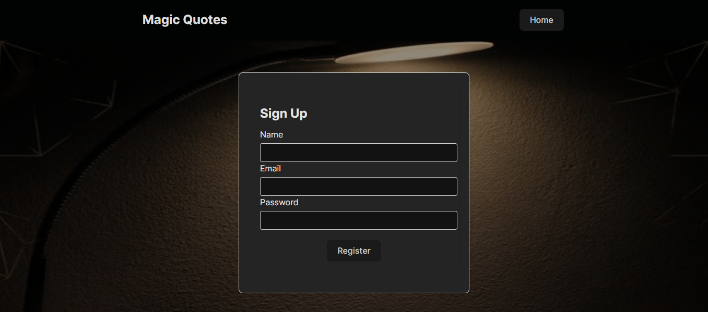
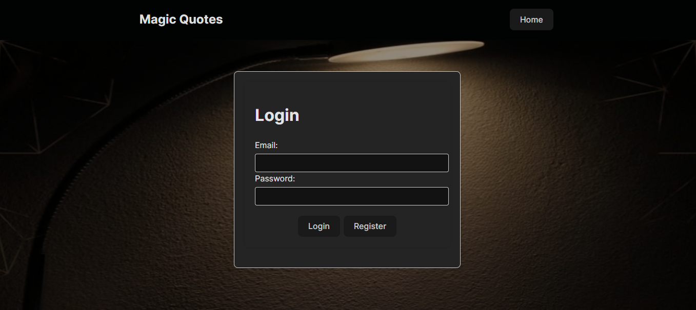
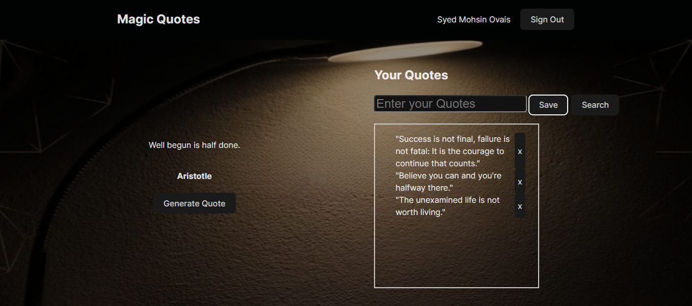

# Magic Quote CRUD React WebApp

A React application that generates random quotes from an API, allows users to save their own quotes, update the quotes, delete the quotes and provides a search functionality. The data is stored in local storage, and users must sign in to manage their own quotes.

## Deployed Link

You can view the live application [here](https://magic-quote-login.vercel.app/).

## Pages

### 1. Home Page

Displays a random "magic quote" and the user's saved quotes if they are signed in.


### 2. Login/Sign Up Page

Allows users to log in or sign up to access their saved quotes.




### 3. User Quotes Page

Displays the user's saved quotes with options to save new quotes and search through existing ones.



## Tools and Technology

- **React**: Frontend library for building user interfaces
- **React Router**: For routing and navigation
- **Axios**: For making API requests
- **Local Storage**: For storing user data
- **CSS**: For styling the application
- **Vite**: Build tool for faster development
- **GitHub**: For version control
- **Netlify** (or Vercel): For deployment

## How to Run Locally

Clone the project

```bash
  git clone https://github.com/mtabba/magic_quote_login
```

Go to the project directory

```bash
  cd my-project
```

Install dependencies

```bash
  npm install
```

Start the server

```bash
  npm run dev
```

## Acknowledgements

Thanks to the [Type Fit API](https://type.fit/api/quotes) for providing the quotes.

Inspired by various tutorials and examples found online.
